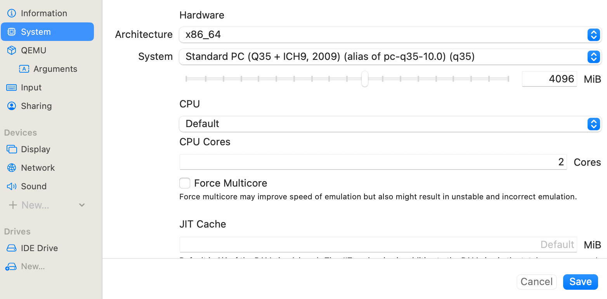
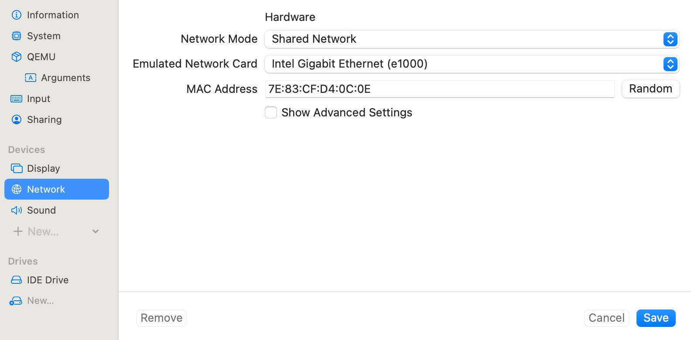

# 🪟 Executando Windows 7 no macOS (Apple Silicon) com UTM

Este guia documenta passo a passo como executar **Windows 7** em computadores macOS com **chip Apple Silicon (ARM)** utilizando o [UTM](https://mac.getutm.app).  

Como o VirtualBox não suporta a execução de sistemas x86 em Macs ARM, a alternativa foi usar **emulação x86 via UTM**, permitindo que o sistema operacional seja executado mesmo em arquitetura diferente.

---

## 📌 Contexto

- **Sistema host:** macOS (Apple Silicon – ARM)
- **Sistema convidado:** Windows 7 (x86)
- **Virtualizador:** UTM (com emulação QEMU)
- **Motivação:** VirtualBox não permite importar appliances x86 no macOS ARM.

---

## 🧰 Pré-requisitos

- macOS com chip Apple Silicon (M1/M2/M3)
- Imagem do Windows 7 em formato `.ova` ou `.vmdk`
- Terminal com acesso a:
  - `tar`
  - `md5` (ou `shasum`)
  - `qemu-img` (instalável via [Homebrew](https://brew.sh/): `brew install qemu`)
- [UTM](https://mac.getutm.app) instalado

---

## 🧾 Verificação da imagem

Antes de iniciar, valide a integridade do arquivo `.ova`:

```bash
md5 W7_Appliance.ova
MD5 (W7_Appliance.ova) = c0429d2e201bedaff491b8563d2ff0db
```

---

## 📦 Extraindo o arquivo `.ova`

O `.ova` é basicamente um arquivo tar compactado:

```bash
tar -xvf W7_Appliance.ova
```

Isso gerará arquivos como:
- `W7_Appliance.ovf`
- `W7_Appliance-disk001.vmdk`
- `W7_Appliance.mf`

---

## 🔁 Convertendo VMDK para QCOW2

O UTM trabalha melhor com o formato **QCOW2**, que é nativo do QEMU.

```bash
qemu-img convert -O qcow2 "W7_Appliance-disk001.vmdk" "W7_Windows7.qcow2"
```

---

## 🖥️ Criando a VM no UTM

1. Abra o **UTM** e clique em **Create a New Virtual Machine**.  
2. Selecione **Emulate** → arquitetura **x86_64**.  
3. Configure:
   - **CPU**: 2 núcleos  
   - **RAM**: 4 GB
4. Em **Drives**, adicione o arquivo `W7_Windows7.qcow2`:
   - Interface: **IDE**
   - Permissões: leitura e escrita
5. Em **Network**, escolha **Shared Network (NAT)**.
6. Vídeo: VGA (sem aceleração 3D para evitar tela azul).
7. Finalize e inicie a VM.

---

## 🪟 Primeiro boot e testes

Se tudo estiver correto:
- O Windows 7 iniciará no modo emulado.
- A VM receberá um IP do NAT interno do UTM (ex.: `192.168.64.11`).
- Você poderá pingar a VM a partir do macOS:
  ```bash
  ping 192.168.64.11
  ```

---

## 🐞 Problemas comuns e soluções

### 📌 Tela azul (BSOD) — `VEoxMouse.sys`
Se aparecer erro:
```
STOP: 0x000000D1 (…)
VEoxMouse.sys
```
➡ Causa: driver de mouse VMware antigo e incompatível.  
✅ Solução:
1. Iniciar em **Modo de Segurança** (`F8` durante o boot).
2. Remover o driver de mouse VMware no Gerenciador de Dispositivos.
3. Renomear ou deletar `C:\Windows\System32\drivers\VEoxMouse.sys`.
4. Reiniciar normalmente.

---

## 🌐 Rede e Conectividade

- O modo “Shared” do UTM cria uma **rede NAT privada** (`192.168.64.0/24`).
- O host macOS possui IP `192.168.64.1`.
- A VM Windows recebe IP `192.168.64.x`.
- Comunicação Host ↔ VM funciona automaticamente (sem port forwarding).

> 💡 Caso queira comunicação com outras VMs (ex.: VirtualBox), é necessário criar rotas ou usar Bridged Mode.

---

## 🧭 Dicas adicionais

- **Snapshots:** UTM permite salvar estados da VM facilmente.  
- **Performance:** por se tratar de **emulação x86 em ARM**, a performance não será igual a uma VM nativa.  
- **Compatibilidade:** mantenha drivers básicos — evite instalar drivers VMware ou VirtualBox dentro da VM.

---

## 🧪 Comandos úteis

Ver informações do disco:
```bash
qemu-img info W7_Windows7.qcow2
```

Listar interfaces de rede virtuais:
```bash
ifconfig
```

---

## ⚙️ Exemplo de configuração da VM no UTM

Abaixo está um exemplo real do arquivo `config.plist` de uma máquina virtual Windows 7 criada no UTM:

```bash
plutil -p "W7_Appliance.utm/config.plist"
```

```plaintext
{
  "Backend" => "QEMU"
  "ConfigurationVersion" => 4
  "Display" => [
    0 => {
      "DownscalingFilter" => "Linear"
      "DynamicResolution" => 1
      "Hardware" => "VGA"
      "NativeResolution" => 0
      "UpscalingFilter" => "Nearest"
    }
  ]
  "Drive" => [
    0 => {
      "Identifier" => "9DC1BA6C-6954-44EC-A8BD-1FA9CF004968"
      "ImageName" => "W7_Windows7.qcow2"
      "ImageType" => "Disk"
      "Interface" => "IDE"
      "InterfaceVersion" => 1
      "ReadOnly" => 0
    }
  ]
  "Information" => {
    "Icon" => "Windows7"
    "IconCustom" => 0
    "Name" => "W7_Appliance"
    "UUID" => "05C1F9E9-AC5F-4F97-A80C-77C592D4A4E1"
  }
  "Input" => {
    "MaximumUsbShare" => 3
    "UsbBusSupport" => "Disabled"
    "UsbSharing" => 0
  }
  "Network" => [
    0 => {
      "Hardware" => "e1000"
      "IsolateFromHost" => 0
      "MacAddress" => "7E:83:CF:D4:0C:0E"
      "Mode" => "Shared"
      "PortForward" => [
      ]
    }
  ]
  "QEMU" => {
    "AdditionalArguments" => [
    ]
    "BalloonDevice" => 0
    "DebugLog" => 0
    "Hypervisor" => 0
    "PS2Controller" => 1
    "RNGDevice" => 1
    "RTCLocalTime" => 0
    "TPMDevice" => 0
    "TSO" => 0
    "UEFIBoot" => 0
  }
  "Serial" => [
  ]
  "Sharing" => {
    "ClipboardSharing" => 1
    "DirectoryShareMode" => "WebDAV"
    "DirectoryShareReadOnly" => 0
  }
  "Sound" => [
    0 => {
      "Hardware" => "intel-hda"
    }
  ]
  "System" => {
    "Architecture" => "x86_64"
    "CPU" => "default"
    "CPUCount" => 2
    "CPUFlagsAdd" => [
    ]
    "CPUFlagsRemove" => [
    ]
    "ForceMulticore" => 0
    "JITCacheSize" => 0
    "MemorySize" => 4096
    "Target" => "q35"
  }
}
```

> 💡 Essa configuração define uma VM com 2 vCPUs, 4 GB de RAM, rede em modo “Shared (NAT)”, vídeo VGA, interface de disco IDE e arquitetura x86_64 emulada.

---

## 🖥️ Exemplo de Configuração no UTM

Abaixo algumas telas ilustrando como configurar a VM:

### Configuração de CPU e Memória


### Configuração de Rede


---

## 📚 Referências

- [UTM Official Site](https://mac.getutm.app)
- [QEMU Documentation](https://www.qemu.org/documentation/)
- [QEMU on Homebrew](https://formulae.brew.sh/formula/qemu)
[](https://www.youtube.com/watch?v=enF3zbyiNZA)

---

## 📝 Licença

Este guia é disponibilizado sob a licença [MIT](LICENSE).  
Sinta-se livre para usar, adaptar e compartilhar.

---
